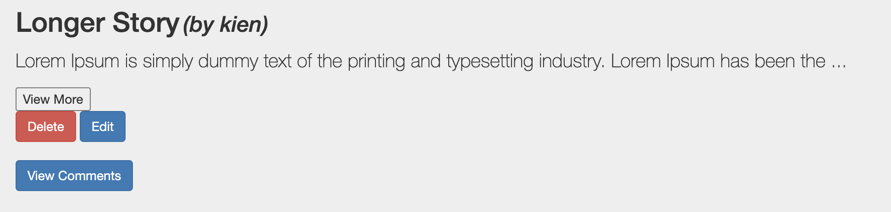
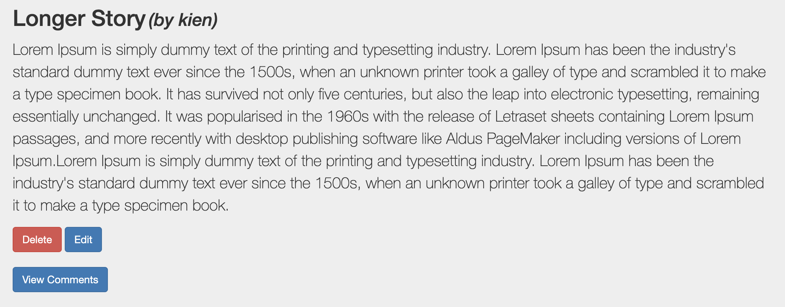
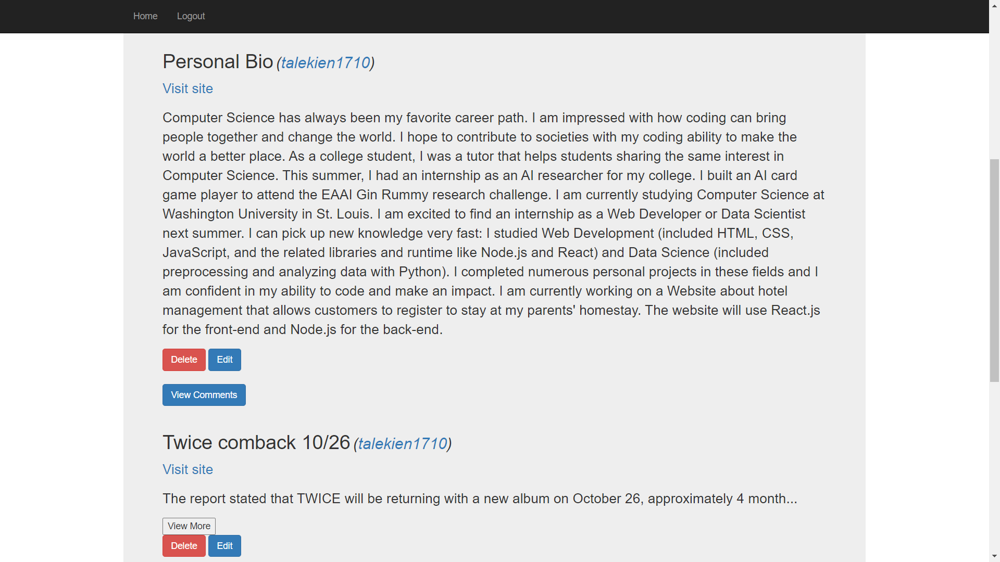

# Social News Website

This project is part of CSE330 - Creative Programming and Rapid Prototyping  
488493 - Anh Le  
488494 - Kien Ta

Link to our story website: http://ec2-3-137-176-157.us-east-2.compute.amazonaws.com/~anhvqle/module3-group-module3-488493-488494/index.html

# Basic functionality:  

A news website where user can share their stories. PHP is used to dynamically generate HTML, as well as to make requests and change the database.  
- Users can register for accounts and then log in to the website.  
- Accounts should have both a username and a secure password (salted and encrypted).  
- Registered users can submit story commentary.  
- Registered users can comment on any story.  
- Unregistered users can only view stories and comments.  
- Registered users can edit and delete their stories and comments.  
- All data about stories, comments are kept in MySQL database.  
- Web security added to prevent attacking, such as CSRF attacks (token added), Injection attacks (prepared queries). Also password is salted and encrypted.  

# Creative portion:

## 1. Personal profile
Every username has a anchor link that directs to their personal website. The personal website includes their personal information (Username, Full name, and Email) and the stories they posted.

## 2. Navigation bar
- The navigation bar is visible everywhere so user can navigate throughout the website in an easier way to login, register, logout, as well as viewing homepage as needed.

## 3. Read More
- The story with more than 100 characters is trimmed to 100 character and a "View More" button

An example of Read More feature:

Before:

After:

## 4. Password validation:
The password users register for must contain the following:
- A lowercase letter
- An uppercase letter
- A number
- Minimum 8 characters

# Registered Users:
- User 1:  
    anhvqle  
    helloVN84

- User 2:  
    talekien1710  
    Kien1234

# Demo 
User  

Non-user  
